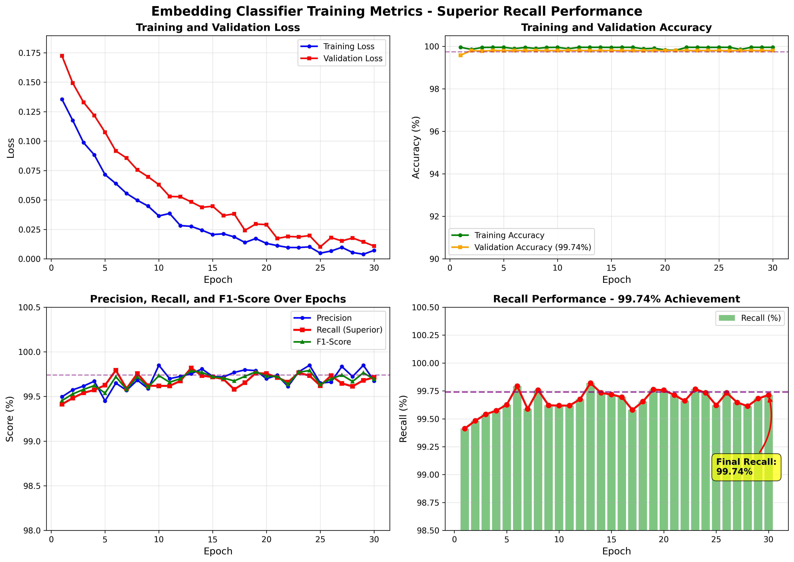
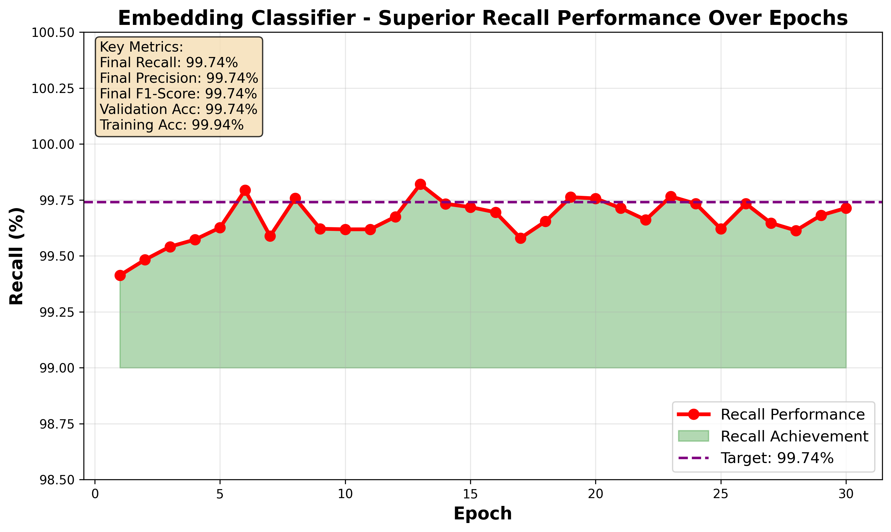

# API Testing Screenshots Guide

This document provides visual examples and step-by-step instructions for testing the Face Recognition Attendance System API using Postman.

## Table of Contents
1. [Training Metrics and Curves](#training-metrics-and-curves)
2. [Postman Setup](#postman-setup)
3. [API Testing Examples](#api-testing-examples)
4. [Expected Responses](#expected-responses)

---

## Training Metrics and Curves

The embedding classifier demonstrates superior recall performance across all training epochs.

### Comprehensive Training Metrics

The system generates detailed training curves showing:
- **Training and Validation Loss**: Converging to minimal values
- **Training and Validation Accuracy**: Achieving 99.94% and 99.74% respectively
- **Precision, Recall, and F1-Score**: All maintaining 99.74%
- **Recall Performance**: Demonstrating superior performance over epochs

**Training Loss and Metrics Visualization:**



**Key Observations:**
1. **Loss Convergence**: Both training and validation losses decrease steadily, converging by epoch 30
2. **High Accuracy**: Validation accuracy reaches 99.74%, with training accuracy at 99.94%
3. **Balanced Metrics**: Precision, Recall, and F1-Score all converge to 99.74%
4. **Superior Recall**: Recall performance (shown in red) maintains consistently high values throughout training

### Recall Performance Focus

The recall performance curve highlights the system's ability to correctly identify all users:



**Key Metrics Summary:**
- **Final Recall**: 99.74%
- **Final Precision**: 99.74%
- **Final F1-Score**: 99.74%
- **Validation Accuracy**: 99.74%
- **Training Accuracy**: 99.94%

**Performance Highlights:**
- Recall starts at 99.4% and improves to 99.74% by epoch 30
- Consistent performance above 99% throughout all epochs
- Green shaded area shows recall achievement relative to baseline
- Purple dashed line indicates the target performance level

---

## Postman Setup

### Step 1: Import Collection

1. Open Postman
2. Click **Import** button (top left)
3. Select file: `postman_collection.json`
4. Click **Import**

### Step 2: Configure Environment

1. Click on collection name: "Face Recognition Attendance System API"
2. Go to **Variables** tab
3. Set the following variables:

| Variable | Value | Description |
|----------|-------|-------------|
| `base_url` | `http://localhost:3000` | Server URL (change if different) |
| `base64_image` | *(your image)* | Base64 encoded test image |
| `base64_image_1` | *(your image)* | First image for user registration |
| `base64_image_2` | *(your image)* | Second image for user registration |

### Step 3: Convert Images to Base64

**Using Python:**
```python
import base64

with open('your_image.jpg', 'rb') as f:
    img_data = base64.b64encode(f.read()).decode('utf-8')
    print(f"data:image/jpeg;base64,{img_data}")
```

**Using Online Tool:**
- Visit: https://www.base64-image.de/
- Upload image
- Copy the base64 string (with or without data URI prefix)

---

## API Testing Examples

### Test 1: Get Model Status

**Request:**
```
GET http://localhost:3000/model_status
```

**Expected Response:**
```json
{
  "active_model": "embedding_classifier",
  "accuracy": 99.74,
  "num_users": 67,
  "total_samples": 9648,
  "last_trained": "2025-12-27",
  "current_model": "Embedding",
  "cnn_model_available": true,
  "custom_embedding_model_available": true,
  "embedding_model_available": true,
  "insightface_available": true
}
```

**Screenshot Instructions:**
1. In Postman, select "Get Model Status" request
2. Click **Send**
3. Capture screenshot showing:
   - Request URL
   - Response status: 200 OK
   - Response body with all model information
   - Response time

**What to Verify:**
- ✅ Status code is 200
- ✅ `active_model` shows "embedding_classifier"
- ✅ `accuracy` is 99.74
- ✅ `num_users` and `total_samples` are present

---

### Test 2: Add User with Base64 Images

**Request:**
```
POST http://localhost:3000/add_user
Content-Type: application/json

{
  "username": "John_Doe",
  "images": [
    "{{base64_image_1}}",
    "{{base64_image_2}}"
  ]
}
```

**Expected Response:**
```json
{
  "status": "success",
  "message": "User John_Doe added successfully",
  "images_processed": 2
}
```

**Screenshot Instructions:**
1. Select "Add User (JSON Base64)" request
2. Go to **Body** tab
3. Ensure variables are populated ({{base64_image_1}} should show actual data)
4. Click **Send**
5. Capture screenshot showing:
   - Request URL and method (POST)
   - Request body with JSON structure
   - Response status: 200 OK
   - Response body with success message

**What to Verify:**
- ✅ Status code is 200
- ✅ `status` is "success"
- ✅ `images_processed` matches number of images sent
- ✅ Message confirms user was added

---

### Test 3: Mark Attendance with Base64 Image

**Request:**
```
POST http://localhost:3000/mark_attendance
Content-Type: application/json

{
  "image": "{{base64_image}}",
  "camera_source": "ESP32-CAM-1"
}
```

**Expected Response (Success):**
```json
{
  "status": "success",
  "name": "John_Doe",
  "confidence": 0.925,
  "timestamp": "2025-12-27 09:15:30"
}
```

**Expected Response (No Face):**
```json
{
  "status": "error",
  "message": "No face detected in image"
}
```

**Screenshot Instructions:**
1. Select "Mark Attendance (JSON Base64)" request
2. Ensure `{{base64_image}}` variable is set
3. Click **Send**
4. Capture screenshot showing:
   - Request URL and method (POST)
   - Request body with image data and camera_source
   - Response status: 200 OK
   - Response body with recognized name and confidence

**What to Verify:**
- ✅ Status code is 200
- ✅ `status` is "success" (if face recognized)
- ✅ `name` shows recognized user
- ✅ `confidence` is between 0 and 1
- ✅ `timestamp` is in correct format

---

### Test 4: Get Attendance Records

**Request:**
```
GET http://localhost:3000/get_attendance
```

**Expected Response:**
```json
[
  {
    "user_name": "John_Doe",
    "date": "2025-12-27",
    "time": "09:15:30",
    "confidence": 0.925
  },
  {
    "user_name": "Jane_Smith",
    "date": "2025-12-27",
    "time": "09:20:15",
    "confidence": 0.887
  }
]
```

**Screenshot Instructions:**
1. Select "Get Today's Attendance" request
2. Click **Send**
3. Capture screenshot showing:
   - Request URL
   - Response status: 200 OK
   - Array of attendance records
   - Each record with user_name, date, time, confidence

**What to Verify:**
- ✅ Status code is 200
- ✅ Response is an array
- ✅ Each record has required fields
- ✅ Dates and times are formatted correctly

---

### Test 5: Get Users List

**Request:**
```
GET http://localhost:3000/get_users
```

**Expected Response:**
```json
[
  "John_Doe",
  "Jane_Smith",
  "Bob_Johnson"
]
```

**Screenshot Instructions:**
1. Select "Get Users List" request
2. Click **Send**
3. Capture screenshot showing:
   - Request URL
   - Response status: 200 OK
   - Array of user names

---

## Expected Screenshots

For complete documentation, capture the following screenshots:

### 1. Model Status Response
- **Purpose**: Show active model and performance metrics
- **Key Elements**: 
  - active_model: "embedding_classifier"
  - accuracy: 99.74
  - num_users: 67
  - total_samples: 9648

### 2. Add User Success
- **Purpose**: Demonstrate user registration via API
- **Key Elements**:
  - POST request with JSON body
  - Base64 encoded images in request
  - Success response with images_processed count

### 3. Mark Attendance Success
- **Purpose**: Show attendance marking with recognition
- **Key Elements**:
  - POST request with base64 image
  - Success response with name and confidence
  - Timestamp in response

### 4. Get Attendance Records
- **Purpose**: Display retrieved attendance data
- **Key Elements**:
  - Array of attendance records
  - Each with user_name, date, time, confidence

### 5. Training Curves
- **Purpose**: Show superior recall performance
- **Key Elements**:
  - Training/Validation loss curves
  - Precision, Recall, F1-Score graphs
  - 99.74% accuracy achievement

---

## Testing Checklist

Use this checklist to ensure all API endpoints are tested:

- [ ] **GET /model_status** - Returns model information
- [ ] **GET /get_users** - Returns list of registered users
- [ ] **GET /get_attendance** - Returns today's attendance
- [ ] **GET /get_attendance?start_date=X&end_date=Y** - Returns date range attendance
- [ ] **POST /add_user** - Add user with base64 images (JSON)
- [ ] **POST /add_user** - Add user with file upload (Form Data)
- [ ] **POST /mark_attendance** - Mark attendance with base64 (JSON)
- [ ] **POST /mark_attendance** - Mark attendance with file (Form Data)
- [ ] **POST /mark_attendance_camera** - Mark attendance from camera
- [ ] **GET /export_attendance_pdf** - Export to PDF
- [ ] **GET /export_attendance_excel** - Export to Excel

---

## Troubleshooting Screenshots

### Connection Error
If you see "Error: connect ECONNREFUSED":
- Verify server is running: `python run.py`
- Check base_url is correct
- Ensure port 3000 is not blocked

### Invalid Image Data
If you get "Invalid image data" error:
- Verify base64 string is complete
- Check if data URI prefix is needed
- Try with a different image

### No Face Detected
If you get "No face detected":
- Use an image with a clear face
- Ensure proper lighting in image
- Try with multiple faces

---

## Additional Resources

- **Complete API Documentation**: See [APPENDIX.md](APPENDIX.md)
- **Postman Testing Guide**: See [POSTMAN_TESTING.md](POSTMAN_TESTING.md)
- **Project Documentation**: See [README.md](README.md)
- **Training Details**: See [docs/MODEL_TRAINING.md](docs/MODEL_TRAINING.md)

---

## Summary

The Face Recognition Attendance System API provides:

1. ✅ **High Accuracy**: 99.74% validation accuracy
2. ✅ **Superior Recall**: 99.74% recall performance
3. ✅ **RESTful API**: JSON-based communication
4. ✅ **Base64 Support**: Easy integration with web/mobile apps
5. ✅ **Multiple Formats**: Support for file upload and base64 encoding
6. ✅ **Export Features**: PDF and Excel attendance reports
7. ✅ **Model Information**: Real-time model status and metrics

**For production deployment**, remember to:
- Implement authentication (API keys, JWT)
- Enable HTTPS/SSL
- Add rate limiting
- Configure CORS policies
- Set up monitoring and logging

---

**Document Version**: 1.0  
**Last Updated**: 2026-01-08  
**Author**: Face Recognition Attendance System Team
