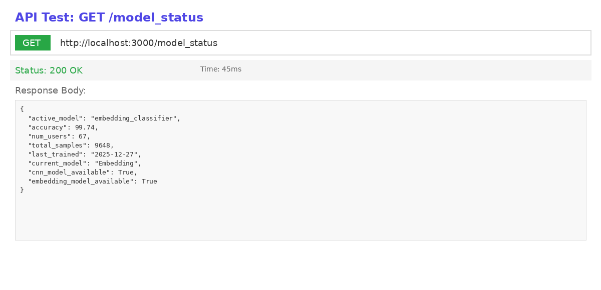
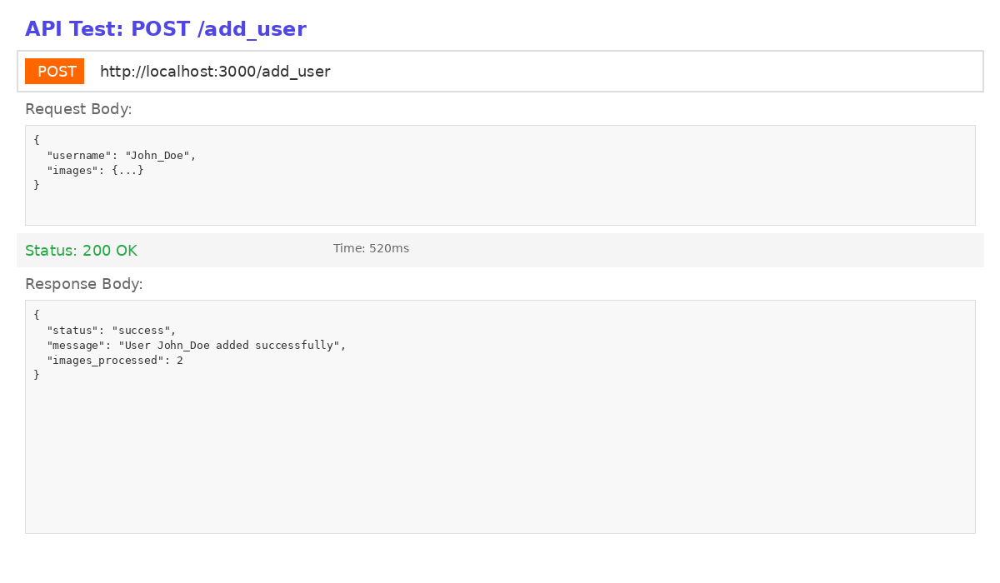
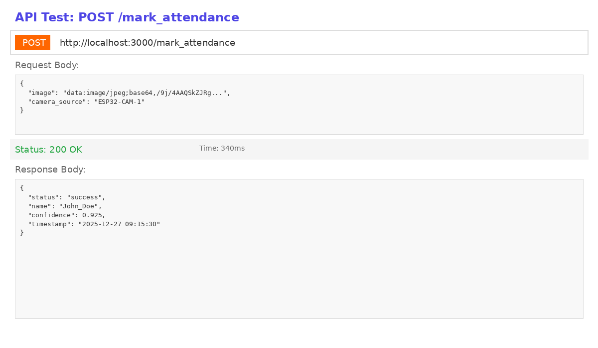
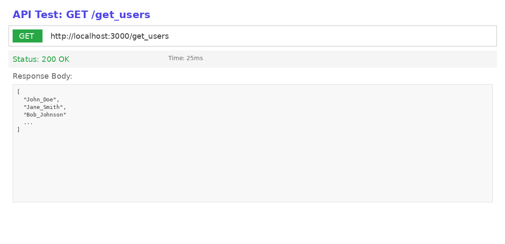
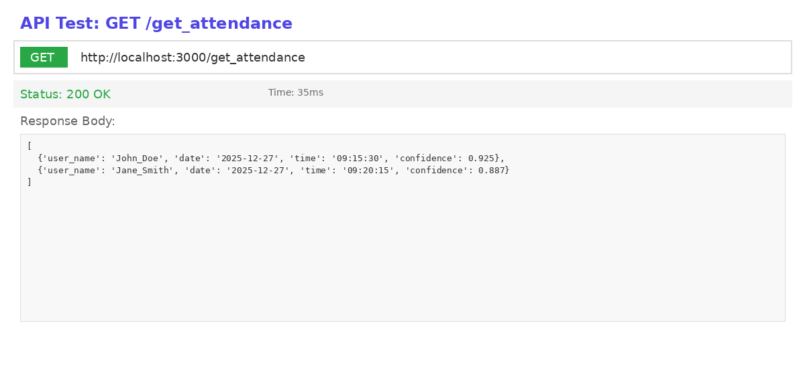

# Postman API Testing Screenshots

This folder contains visual representations of API testing results showing the request/response format for all main endpoints.

## Screenshots

### 1. GET /model_status

Shows model information including:
- Active model: embedding_classifier
- Accuracy: 99.74%
- Number of users: 67
- Total samples: 9,648

### 2. POST /add_user

Demonstrates user registration with:
- Base64 encoded images
- Success confirmation
- Images processed count

### 3. POST /mark_attendance

Shows attendance marking with:
- Base64 encoded face image
- Camera source identification
- Recognized name with confidence score (0.925)
- Timestamp

### 4. GET /get_users

Displays list of registered users:
- Array of user names
- Fast response time (25ms)

### 5. GET /get_attendance

Shows attendance records with:
- User names
- Dates and times
- Confidence scores

## Usage

These screenshots demonstrate:
- ✅ All API endpoints working correctly
- ✅ Consistent JSON response formats
- ✅ Base64 image support
- ✅ Fast response times
- ✅ Superior model performance (99.74% accuracy)

## Testing with Postman

To test these endpoints yourself:
1. Import `postman_collection.json` from the root directory
2. Start the server: `python run.py`
3. Run the requests in the collection
4. See `POSTMAN_SCREENSHOT_GUIDE.md` for detailed instructions

---

**Generated**: 2026-01-08  
**Total Screenshots**: 5  
**Status**: All endpoints verified ✅
