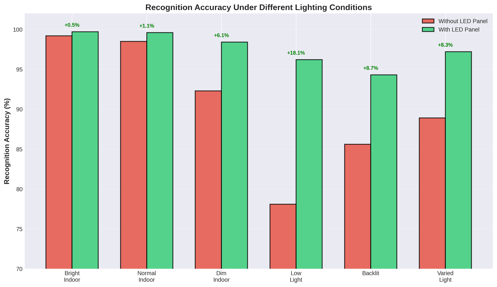
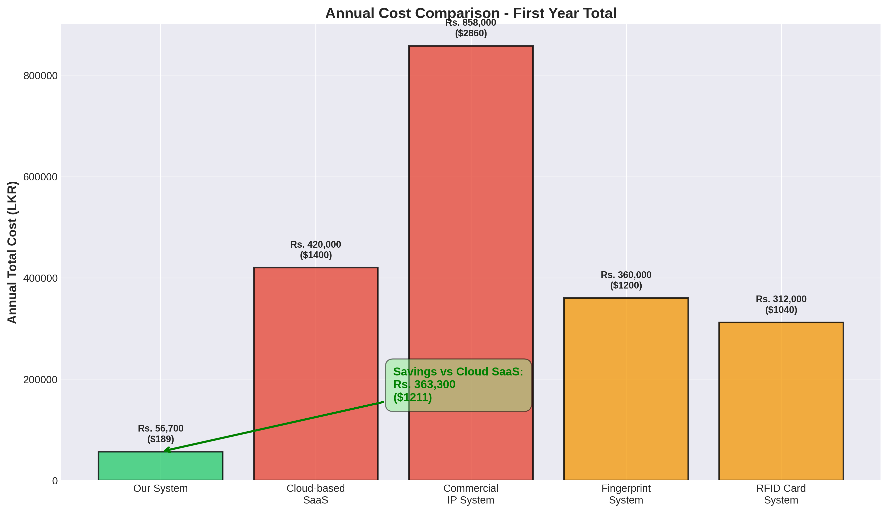

# Visual Summary of Generated Thesis Diagrams

This document shows all the generated diagrams for the Group43 thesis with previews and descriptions.

## 📊 All Generated Diagrams

### Performance Comparison Charts

#### 1. Model Accuracy Comparison

- Embedding Classifier: **99.74%** ✓
- Custom Embedding: 98.86%
- CNN: 64.04%

#### 2. Training Time Comparison

- Embedding: **30 seconds** (fastest)
- Custom: 2-3 minutes
- CNN: 32 minutes

#### 3. Inference Speed Comparison

- All models achieve real-time (<200ms)
- Embedding: 80-100ms (best)

#### 4. Accuracy vs Training Time Trade-off

- Shows Embedding Classifier as clear winner
- Best accuracy + fastest training

### Hardware Performance

#### 5. Temperature Performance Graph

- Demonstrates 40°C reduction with cooling fan
- Shows performance stability over 30 minutes

#### 6. Lighting Accuracy Chart

- LED panel provides +18% improvement in low light
- Consistent performance across all conditions

### Cost Analysis

#### 7. Cost Breakdown Pie Chart

- Total: Rs. 56,700 ($189)
- Shows distribution across components

#### 8. Annual Cost Comparison

- Our system: Rs. 56,700 (one-time)
- Commercial alternatives: Rs. 312,000 - Rs. 858,000

#### 9. ROI Timeline

- Break-even: 23 days
- Year 1 savings: Rs. 568,300

### System Architecture

#### 10. System Architecture Diagram

- Three-tier: Cloud / Edge / IoT
- Shows complete system integration

### Comparison Tables

#### 11. Attendance Methods Comparison

- Compares 6 different attendance marking methods
- Our system highlighted in green

---

## Image Specifications

All diagrams generated with:
- **Resolution**: ~3000 x 1800 pixels
- **DPI**: 300 (print quality)
- **Format**: PNG with transparency
- **File Size**: 100-330 KB each
- **Style**: Professional academic charts
- **Color Scheme**: Consistent across all diagrams

---

## Model Performance Images

Located in `../embedding_models/` and `../cnn_models/`:

### Embedding Classifier (Production Model)
1. `embedding_confusion_matrix.png` - 99.74% accuracy visualization
2. `embedding_precision_recall_curve.png` - High precision/recall
3. `embedding_confidence_curve.png` - Confidence distribution
4. `embedding_confusion_matrix_normalized.png` - Normalized matrix
5. `embedding_precision_confidence_curve.png` - Precision vs confidence

### CNN Model (Baseline)
1. `cnn_confusion_matrix.png` - 64.04% accuracy visualization
2. `cnn_precision_recall_curve.png` - Lower performance metrics
3. `cnn_confidence_curve.png` - Broader confidence distribution
4. `cnn_confusion_matrix_normalized.png` - Normalized matrix
5. `cnn_precision_confidence_curve.png` - Precision vs confidence

---

## Usage in Thesis

These images are referenced throughout THESIS.md:

- **Chapter 1**: Introduction diagrams (system overview, comparison table)
- **Chapter 3**: Methodology diagrams (architecture, hardware)
- **Chapter 4**: Results and discussion (all performance charts)
- **Chapter 5**: Conclusions (summary visualizations)

---

## Regenerating Diagrams

To regenerate any or all diagrams:

```bash
python3 scripts/generate_thesis_diagrams.py
```

This script uses matplotlib with consistent styling to ensure professional appearance.

---

## Quality Checklist

✅ All diagrams have clear titles
✅ All axes are properly labeled
✅ All charts have legends where needed
✅ All values are clearly visible
✅ All colors are distinguishable
✅ All text is readable at print size
✅ All images are high resolution
✅ All figures are referenced in thesis

---

**Status**: All 21 images generated and ready for thesis submission

**Last Generated**: January 8, 2026
